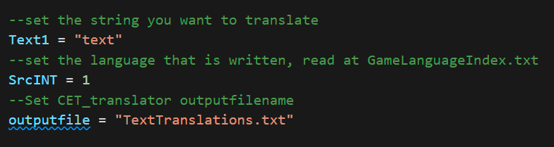
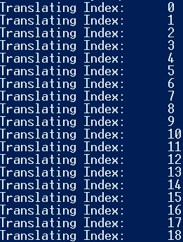
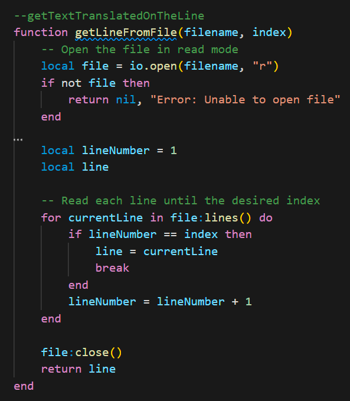

# CET_TRANSLATOR

Translate your MOD texts to the desired Cyberpunk2077 UI language. This mod is a tool for CET modders that translates string variables.

## Installation

1. **Install PHP on your local machine**
   - Download and install PHP from [https://www.php.net/](https://www.php.net/)

2. **Extract CET_TRANSLATOR**
   - Extract the `CET_TRANSLATOR` to your `CyberEngineTweaks` directory:
     ```
     Cyberpunk2077\bin\x64\plugins\cyber_engine_tweaks
     ```

## Usage

1. **Configure `set.lua`**
   - 
   - Write your text, source language, and output filename in `set.lua`.

2. **Compile `set.lua`**
   - 
   - Compile `set.lua` to store your translations in the output file.


3. **Use `init.lua`**
   - `init.lua` has built-in functions to retrieve the translated text.
   - 

## Info

- **Packed in:**
  - PHP 8.3.9
  - CET v1.32.2
  - Cyberpunk 2077 v2.12

---

*By Lgomes_gvizstudio*
